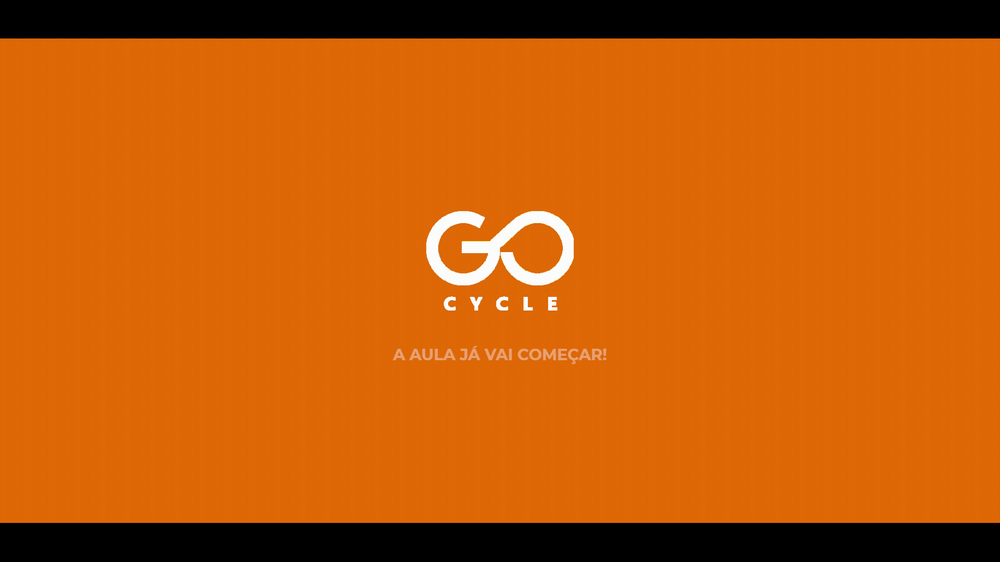
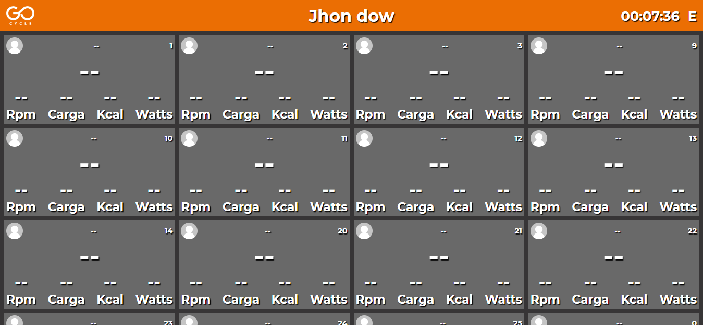
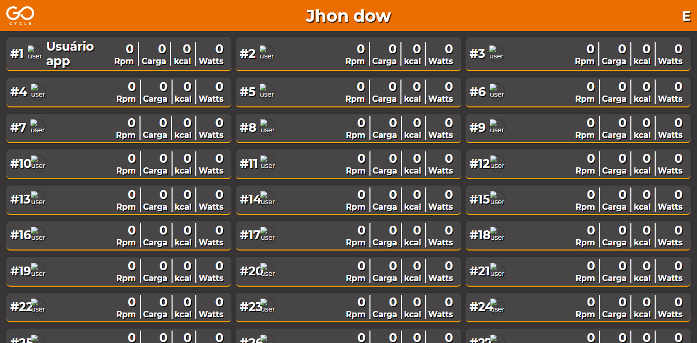

# About

Projeto desenvolvido para uma academia de bicicletas que exibe informações em tempo real em telão. Essas bicicletas possuem um hardware conectado que envia informações sobre RPM, marcha e calorias gastas pelos ciclistas.

Para fazer a simulação das bikes enviando estes dados para o back-end, desenvolvi um mini bot que simula estas requisições. O mesmopode ser encontrado dentro de `src/bot.js`.

---

> [!NOTE]
> O projeto foi encerrado, por isso o sistema não está com todas as funcionalidades.

# Technologies

- Nodejs ☸
- Expressjs 📍
- Socketio 📨
- Ejs :page_facing_up:
- Firestore :fire:

# Screenshots

Tela de carregamento

Dashboard

Tela de rank

# Run project

Instalar dependências:

`npm install`

Rodar servidor:

`npm run dev`

Rodar bot que faz as requisições de exemplo:

`npm run bot`

---
